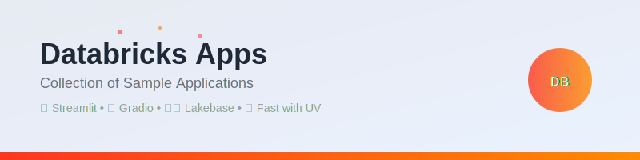

<div align="center">

[](https://github.com/jules/databricks-apps)

[](./README.md#apps-overview)
[](./README.md#apps-overview)
[](https://docs.astral.sh/uv/)
[](https://docs.databricks.com/en/dev-tools/databricks-apps/index.html)

</div>

# Databricks Apps Collection

A collection of sample Databricks Apps demonstrating different frameworks, integrations, and use cases for building applications on the Databricks platform.

## Apps Overview

### 🏖️ Holiday Request Manager
**Location**: `holiday_request_app/`
**Framework**: Streamlit
**Database**: Databricks Lakebase (PostgreSQL)

A full-stack holiday request management system showcasing the integration between Databricks Lakebase and Databricks Apps. Features include:

- **Employee holiday request submission and tracking**
- **Manager approval/decline workflow with comments**
- **Real-time status updates with color-coded interface** (🟡 Pending, 🟢 Approved, 🔴 Declined)
- **OAuth-based authentication** with automatic token management
- **Radio button selection interface** for intuitive request management

**Key Technologies**: SQLAlchemy, psycopg, OAuth tokens, session state management

**Notable Features**: Demonstrates proper PostgreSQL connection patterns with OAuth token injection, comprehensive error handling, and enterprise-grade security through Unity Catalog integration.

### 🤖 Chatbot CUJ App
**Location**: `chatbotcuj_app/`
**Framework**: Gradio
**Integration**: Model Serving Endpoints

A conversational AI chatbot demonstrating integration with Databricks Model Serving endpoints. Features include:

- **Chat interface** with conversation history
- **LLM endpoint integration** with configurable parameters
- **OpenAI-style message formatting** for compatibility
- **Error handling and logging** for production reliability
- **Environment-based configuration** through app.yaml

**Key Technologies**: Gradio ChatInterface, Databricks Model Serving, OpenAI message format

**Notable Features**: Shows how to build production-ready chatbots with proper error handling, request logging, and seamless integration with Databricks serving infrastructure.

### 🚀 Simple Streamlit App
**Location**: `simple_streamlit_app/`
**Framework**: Streamlit
**Purpose**: Basic demonstration

A minimal Streamlit application demonstrating basic Databricks Apps functionality. Features include:

- **Simple button interactions** with immediate feedback
- **Session state management** for persistent interactions
- **Clean, centered page layout** with modern UI elements
- **Multiple interaction patterns** (immediate and persistent buttons)

**Key Technologies**: Streamlit core components, session state

**Notable Features**: Perfect starting point for new Databricks Apps, demonstrates fundamental Streamlit patterns and session management.

### 🗄️ Simple Lakebase App
**Location**: `simple_lakebase_app/`
**Framework**: Streamlit
**Database**: Databricks Lakebase (PostgreSQL)

A basic database connectivity demonstration showing how to connect Streamlit apps to Lakebase. Features include:

- **Direct PostgreSQL connection** using OAuth authentication
- **Database introspection** with connection details display
- **Token presence verification** for debugging
- **Simple data retrieval** from holiday requests table

**Key Technologies**: SQLAlchemy, psycopg, OAuth tokens, PostgreSQL

**Notable Features**: Minimal example of Lakebase integration, useful for understanding basic database connection patterns and debugging connectivity issues.

## Common Patterns

### Authentication
All apps use **OAuth token-based authentication** through the Databricks SDK:
```python
from databricks.sdk import WorkspaceClient
workspace_client = WorkspaceClient()
token = workspace_client.config.oauth_token().access_token
```

### Database Connectivity (Lakebase Apps)
PostgreSQL connections use **automatic token injection**:
```python
@event.listens_for(engine, "do_connect")
def provide_token(dialect, conn_rec, cargs, cparams):
    cparams["password"] = workspace_client.config.oauth_token().access_token
```

### Deployment Configuration
Apps use `app.yaml` for runtime configuration:
- **Port specification** (typically 8000 for Streamlit)
- **Server address binding** (0.0.0.0 for proper networking)
- **Environment variables** for service endpoints
- **Resource declarations** (database instances, model endpoints)

## Dependency Management

All apps in this project use **[uv](https://docs.astral.sh/uv/)** for fast and reliable Python package management. uv provides:

- **Ultra-fast dependency resolution** - 10-100x faster than pip
- **Deterministic installs** with lock files
- **Virtual environment management** built-in
- **Compatible with pip** and existing Python workflows

### Installing uv

```bash
# macOS and Linux
curl -LsSf https://astral.sh/uv/install.sh | sh

# Windows
powershell -c "irm https://astral.sh/uv/install.ps1 | iex"

# With pip (if you already have Python)
pip install uv
```

For more installation options, see the [uv installation guide](https://docs.astral.sh/uv/getting-started/installation/).

## Getting Started

### Prerequisites
- Databricks workspace with Apps enabled
- Unity Catalog configured
- Lakebase instance (for database apps)
- Model Serving endpoint (for chatbot app)
- **[uv](https://docs.astral.sh/uv/)** for dependency management

### Basic Deployment Process
1. **Create new Databricks App** in your workspace
2. **Configure resources** (database, model endpoints) as needed
3. **Upload application code** or clone from repository
4. **Deploy with one-click** through the Databricks interface

### Local Development
Each app includes development setup instructions using uv:
```bash
# Initialize project and create virtual environment
uv init

# Install dependencies from requirements.txt
uv add -r requirements.txt

# Activate virtual environment
source .venv/bin/activate

# Or run directly with uv (recommended)
uv run streamlit run app.py --server.port=8000
```

For more detailed uv usage, see the [uv getting started guide](https://docs.astral.sh/uv/getting-started/).

## Architecture Benefits

### Databricks Apps Platform
- **Serverless runtime** - No infrastructure management required
- **Built-in authentication** - OAuth integration with workspace identity
- **Unity Catalog integration** - Seamless governance and security
- **One-click deployment** - Simplified CI/CD workflows

### Databricks Lakebase
- **Fully managed PostgreSQL** - No database administration overhead
- **Low-latency operations** - Optimized for transactional workloads
- **Lakehouse integration** - Native connectivity to Delta Lake
- **Built-in security** - Automatic encryption and access controls

## Development Guidelines

### Code Quality
- Use **type hints** for better code maintainability
- Implement **comprehensive error handling** with user-friendly messages
- Follow **PEP 8** style guidelines (use Black for formatting)
- Include **docstrings** for complex functions

### Security Best Practices
- **Never hardcode credentials** - Use OAuth tokens and environment variables
- **Validate user inputs** to prevent SQL injection
- **Use parameterized queries** with SQLAlchemy
- **Implement proper access controls** through Unity Catalog

### Performance Considerations
- **Use connection pooling** for database operations
- **Implement caching** for expensive operations
- **Monitor resource usage** through Databricks observability
- **Optimize queries** and data retrieval patterns

## Contributing

When adding new apps to this collection:

1. **Follow naming conventions** - Use descriptive directory names
2. **Include comprehensive README** - Document purpose, setup, and key features
3. **Provide sample data** - Include test datasets where applicable
4. **Add proper error handling** - Ensure production-ready code quality
5. **Update this main README** - Add your app to the overview section

## Resources

### Databricks Platform
- [Databricks Apps Documentation](https://docs.databricks.com/en/dev-tools/databricks-apps/index.html)
- [Databricks Lakebase Guide](https://docs.databricks.com/en/lakehouse/lakebase.html)
- [Model Serving Documentation](https://docs.databricks.com/en/machine-learning/model-serving/index.html)
- [Unity Catalog Security](https://docs.databricks.com/en/data-governance/unity-catalog/index.html)

### Development Tools
- [uv Documentation](https://docs.astral.sh/uv/) - Fast Python package and project manager
- [uv Getting Started](https://docs.astral.sh/uv/getting-started/) - Installation and basic usage
- [uv User Guide](https://docs.astral.sh/uv/guides/) - Comprehensive tutorials and guides

---

*Built with ❤️ on the Databricks platform*

Each app in this collection demonstrates different aspects of building modern data applications with integrated security, governance, and deployment capabilities.